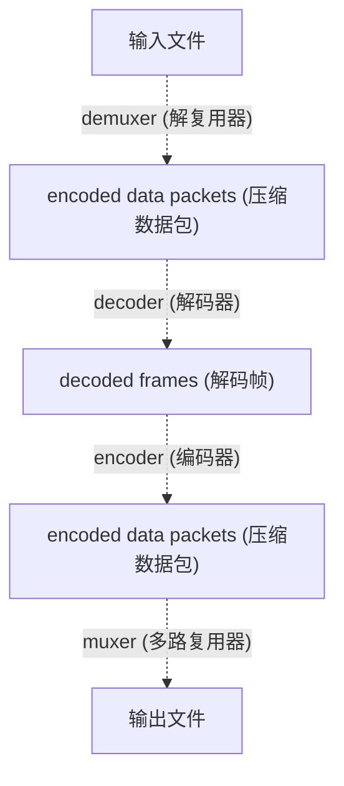
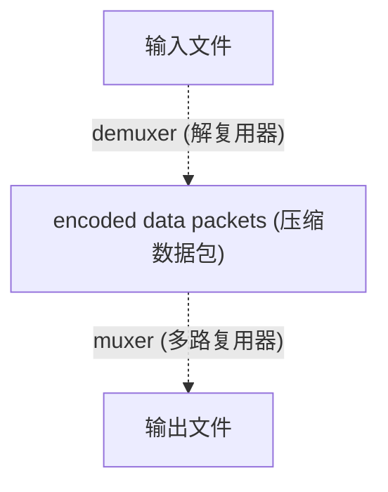

# #2 命令行参数

## ffmpeg 命令格式

`ffmpeg` 命令遵循以下格式: 

```bat
ffmpeg <[全局参数]> <[输入参数]> -i <输入文件> <[输出参数]> <输出文件>
```

其中, **输入文件** 和 **输出文件** 是必须的. 其他的参数 (**全局参数**, **输入参数**, **输出参数**)是可选的. 

---

### 视频转码

以一个最简单的 `ffmpeg` 命令举例: 

```bat
ffmpeg -i "input.flv" "output.mp4"
```

- `ffmpeg`: 表示使用 `ffmpeg` 进行处理. 
- `-i "input.flv"`: 表示将视频 **input.flv** 作为输入文件. 因为没有指定绝对路径, 所以是在**命令行所在的目录**寻找 **input.flv** 文件. 
- `"output.mp4"`: 表示输出一个新的视频文件 **output.mp4**. 

> 这行命令的作用 **视频转码** , 但是速度很慢, 之后我们会学习一个更快的命令: **视频转封装**. 


## ffmpeg 的视频处理模式

### 正常处理流程



首先输入文件是需要通过一个 `demuxer` 的处理器, 通常叫做 **解复用器**, 这个处理器的作用通常就是**分离视频数据**和**音频数据**, 如果是 `.mkv` 格式的视频, 可能还存在**字幕数据**, **多个视频/音频数据**等等. 

我们按正常视频容器理解(即只有1个视频流和1个音频流), 经过 `demuxer` , 分离出了两个流: 视频流 (`stream1`) 和音频流 (`stream2`), 这就是下面的 `encoded data packets` . 

然后经过 `decoder` 解码器, 会将**压缩过的流数据**进行解码, 还原成原始的**解码帧**. 

然后通过 `encoder` 编码器, 能够将 **解码帧**, 重新按照**指定的编码**, 重新进行编码, 于是我们拿到两个重新编码后的流: `stream1` 和 `stream2`. 

然后通过 `muxer` , 再将这两个流重新合成为 1 个视频文件. 

> `decoder` 和 `encoder` 的过程可以简单理解为**解压**和**压缩**. 
>
> 正常情况下我们拿到的视频文件是一个压缩包. 然后通过视频播放软件打开的时候, 就好像直接通过解压缩软件去打开压缩包内的文件, 而不是先完全解压再打开. 
> 在这种情况下,  视频播放软件(解压缩软件)会先解压出一部分内容, 再展示给你看. 
>
> 然后由于各种格式的压缩度, 以及压缩包内携带的信息存在差异, 所以播放的时候会存在一定的效率问题. 
> 最容易感知的就是`.flv` 容器, 比如视频时间显示不准确, 以及在低性能机器上跳转视频会卡顿的问题是比较容易出现的.
>
> 上面的先 `decoder` 再 `encoder` 的流程, 可以理解为: 
> 我拿到了一个 `.zip` 格式的压缩包, 然后想要将其变成 `.7z` 格式的压缩包, 有些时候甚至想要修改里面的文件, 那么肯定是需要将所有文件全部解压, 然后修改/删除里面的部分内容, 然后再重新压缩成 `.7z` 格式的压缩包. 这就是上面的 `ffmpeg` 流程. 


### 流复制处理流程



在理解完上面的完整流程之后, 我们可以看到是有个简化的流程的. 通过在输出参数中使用 `-c copy` 参数, 我们能够让 `ffmpeg` 的视频处理模式, 进入到流复制处理流程. 

在流复制处理流程中, 可以看到, 是没有 `decoder` 和 `encoder` 的参与的, 也就是我们不修改文件, 只对压缩数据包进行处理. 然后由于处理的是压缩数据, 而不是原始数据, 所以输出结果并不精准, 毕竟压缩会损失信息. 

所以流复制处理流程通常只用于处理一些不涉及精准操作的内容, 比如: **视频转封装**, **单独提取视频/音频**.

#### 视频转封装

```bat
ffmpeg -i "input.flv" -c copy "output.mp4"
```

这行命令的作用和上面的 **视频转码** 是一样的, 都是将 `.flv` 转成 `.mp4` 格式. 速度很快, 但是只能在视频是 **同一种编码** 的情况下使用, 如果是不同编码那就需要使用 **视频转码**. 

通常 **视频转封装** 只能在以下几种视频格式之间互相转换, 但是也使用大部分视频: `.avi` <----> `.ts` <----> `.flv` <----> `.mkv` <----> `.mp4 `<----> `.mov`

> 关于视频编码, 转码和转封装的区别, 下一章关于编码的内容会进行详细解释. 

#### 单独提取视频

```bat
ffmpeg -i "input.mp4" -an -c:v copy "output.mp4"
```

- `-an`: 表示不处理音频, 即忽略音频流. 
- `-c:v copy`: 在 `-c` 后面添加 `:v` 限定, 表示只针对视频流进行流复制. (即限定视频`video`)

#### 单独提取音频

```bat
ffmpeg -i "input.mp4" -vn -c:a copy "output.mp4"
```

- `-vn`: 表示不处理视频, 即忽略视频流. 
- `-c:a copy`: 在 `-c` 后面添加 `:a` 限定, 表示只针对音频流进行流复制. (即限定音频`audio`)


## 官方文档

> - 官网: https://ffmpeg.org/download.html
> - 英文文档: https://ffmpeg.org/documentation.html
> - 中文文档: https://ffmpeg.github.net.cn/documentation.html