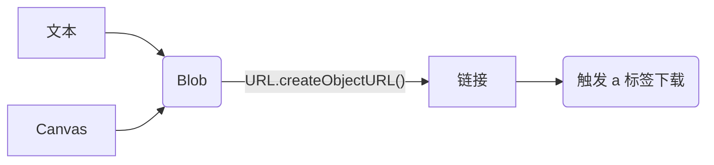

# 下载文件到本地

## 概念

前端领域中关于文件的概念一般分为四种: 

- 纯文本
- 链接 (图片链接, 视频链接, base64 编码, blob 临时链接)
- `Blob`
- `Canvas`

能够将文件下载到本地的原生方案, 就是使用**Blob 对象**和 **URL 生成机制**，结合 `<a>` 标签的 `download` 属性实现文件下载. 

所以基本方案就是以下流程图: 



> 本篇文章不涉及复杂视频的处理, 如使用分片传输的视频. 

## 下载链接

直接创建一个隐藏的 `<a>` 标签, 并且赋值即可. `href` 属性是链接地址, `download` 属性是文件名, 然后模拟点击 `<a>` 标签就会进入下载. 

```js
/**
 * 通过链接下载文件到本地
 *
 * @param {string} url 文件链接
 * @param {string} filename 文件名
 */
const downloadLink = ( url, filename ) => {
    const a = document.createElement( 'a' );
    a.href = url;
    a.download = filename;
    a.click();
};
```

不过这样写还会有一个问题, 只能保存 **同源** 的文件, 如果不是同源的文件, 由于安全策略的限制, `download` 属性失效, 会触发 `<a>` 标签跳转而不是下载该文件. 

比如, 我在本地开启了一个网页服务: `http://localhost:8080`, 我要下载百度网页: 

```js
downloadLink( 'https://www.baidu.com', 'baidu.html' );
```

这时候你本地网页其实会直接跳转到百度页面去. 这种情况在下载一些**非同源**的图片也是同理的. 

那么该如何解决呢? 这里需要将链接对应的内容转成 `Blob` (相当于将对应的文件先下载到内存中) , 直接再将 `Blob` 转成 `Blob 临时链接` 进行下载, 即 `链接 -> Blob -> Blob 临时链接 -> 下载`. 该部分内容我们讲完下载 `Blob` 后会重新进行说明. 


## 下载文本文件

> 只要是可以被记事本打开的文件, 都算文本文件, 包括文件文件 `.txt`, Json 文件 `.json`, 字幕文件 `.srt`, 网页文件 `.html` 等...

首先, 你需要明确你需要的是什么内容: 
如果需要一个 JSON 文件, 那么就将对象通过 `JSON.stringify()` 转成文本; 
如果需要一个 markdown 文件, 那么就根据文档需要的格式, 将你的信息进行字符串化....

然后根据你需要下载的文件类型, 查询对应的 `mimeType`, 常见的文本文件类型对应的 `mimeType` 有: 

- 纯文件: `text/plain`
- JSON 文件: `application/json`
- markdown 文件: `text/markdown`
- html 文件: `text/html`

> 更多 `mineType` 类型可以通过网站 [mime.wcode.net](https://mime.wcode.net/zh-hans/) 查询. 

首先要通过 [`Blob`](https://developer.mozilla.org/zh-CN/docs/Web/API/Blob/Blob) 构造一个 **文本 Blob** 文件, 注意 `mimeType` 的类型要准确:

```js
const blob = new Blob( [ text ], { type: mimeType } );
```

之后通过 `URL.createObjectURL()` 函数创建一个**临时 blob 链接**, 之后通过上一小节的 **下载链接** 函数下载该链接即可: 

```js
// 创建临时 blob url
const blobUrl = URL.createObjectURL( blob );
// 通过 blob url 下载文件到本地
downloadLink( blobUrl, filename );
// 释放 blob (500 ms 延时防止下载错误)
window.setTimeout(() => URL.revokeObjectURL( blobUrl ), 500)
```

**完整函数**

```js
/**
 * 下载文本到本地
 * @param {text} text 文本内容
 * @param {string} filename 文件名
 * @param {string} mimeType 文件类型
 */
const downloadText = (
    text,
    filename,
    mimeType = 'text/plain',
) => {
    // 创建 blob
    const blob = new Blob( [ text ], { type: mimeType } );
    // 创建 blob url
    const blobUrl = URL.createObjectURL( blob );
    // 通过 blob url 下载文件到本地
    downloadLink( blobUrl, filename );
    // 释放 blob (500 ms 延时防止下载错误)
    window.setTimeout(() => URL.revokeObjectURL( blobUrl ), 500)
};
```


## 下载二进制文件

下载二进制文件和上述的下载文本文件基本一致, 只不过不需要使用手动创建 Blob 对象, 而是根据链接去下载 Blob 对象. 

第一步是通过 `fetch` 函数对链接进行网络请求, 将对应的内容 (图片/视频) 下载到本地缓存中, [`fetch`](https://developer.mozilla.org/zh-CN/docs/Web/API/Window/fetch) 返回的 [`Response`](https://developer.mozilla.org/zh-CN/docs/Web/API/Response) 对象中存在一个方法 [`Response.blob()`](https://developer.mozilla.org/zh-CN/docs/Web/API/Response/blob) , 可以将返回值中的内容解析成 Blob 对象: 

```js
const blob = await fetch( url ).then( res => res.blob() );
```

后面就是一样的创建临时 blob 链接 -> 下载 -> 释放缓存了. 

**完整函数**

```js
/**
 * 下载二进制文件到本地
 */
const downloadBinary = async (
    url,
    filename,
) => {
    const blob = await fetch( url ).then( res => res.blob() );
    const blobUrl = URL.createObjectURL( blob );
    downloadLink( blobUrl, filename );
    window.setTimeout( () => URL.revokeObjectURL( blobUrl ), 500 );
};
```

