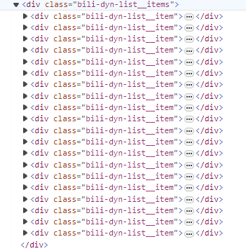
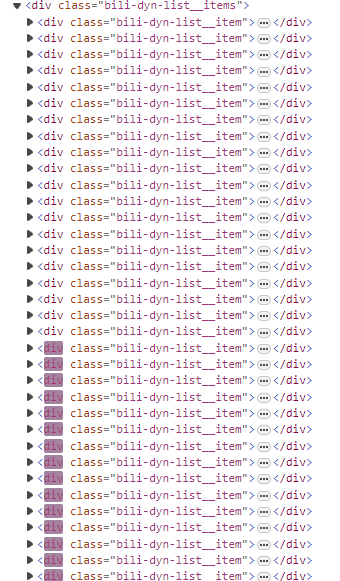

# 监听B站动态的加载

因为最近写的脚本有好几个都涉及[B站动态](https://t.bilibili.com/), 而B站动态是分段加载的, 所以也分享一下这方面的思路.

如果不想看我扯一大堆的话, 可以直接跳到文章的最后看具体的代码.

## 目录

本文将涉及:

- 简单使用`MutationObserver`.
- 在使用`MutationObserver`之前, 如何判断加载页面元素的加载逻辑?
- 自定义事件的派发, 并携带自定义数据
- 工具类: `DynamicLoad`

> 为了方便读者理解, 本文中的代码统一使用JavaScript, 除了最后的工具类有一个TypeScript版本.

> 本文不介绍`MutationObserver`的理论, 如果这个API感到陌生的读者,
>
可以查阅 [油猴开发指南-MutationObserver](https://learn.scriptcat.org/docs/category/mutationobserve-%E7%9F%A5%E8%AF%86/), [MDN-MutationObserver](https://developer.mozilla.org/zh-CN/docs/Web/API/MutationObserver).

## 思路

监听B站动态加载其实很简单,
直接在动态列表的容器上绑定一个[MutationObserver](https://developer.mozilla.org/zh-CN/docs/Web/API/MutationObserver)就可以,
不过有一个问题, `MutationObserver`返回的`Array<MutationRecord>`中的信息太多了, 如果只是单次处理还好, 多次处理就会非常麻烦.

基于这一点, 我们可以自己写一个工具类, 用来将`MutationObserver`返回的信息先进行统一处理, 直接再返回处理后的数据.

> 动态列表容器的类: `.bili-dyn-list__items`
>
> 每一条动态容器的类: `.bili-dyn-list__items`

### 如何使用`MutationObserver`观察页面的加载逻辑

由于每个网站的加载逻辑是不同的, 我们需要先观察B站动态的加载逻辑.

首先打开开发者工具(F12), 进入[B站动态首页](https://t.bilibili.com/), 选中任意一个动态,
可以找到其父元素`.bili-dyn-list__item`, 这是动态容器.

还可以找到`.bili-dyn-list__item`的父元素`.bili-dyn-list__items`, 这是动态列表容器.



然后我们一直滚动页面, 直到页面加载新的动态, 可以发现B站的动态是直接在`.bili-dyn-list__items`动态列表容器的基础上新增Node节点,
这是最简单的元素加载, 可以直接监听`.bili-dyn-list__items`容器的Node节点加载即可.



于是我们绑定页面的动态列表容器, 观察其节点增删:

```js
new MutationObserver( ( recordList ) => {
	console.log( recordList );
} ).observe( document.querySelector( '.bili-dyn-list__items' ), {
	childList: true
} )
```

返回的`recordList`如下:


经过分析可以发现, 当新的动态加载时, 触发的`MutationObserver`回调中的每条`MutationRecord`中的`addedNodes[0]`就是一条新加载的动态.

所以, 我们可以通过以下代码获取新加载的动态:

```js
const dynamicUpdateObserver = new MutationObserver( ( recordList ) => {
	recordList.forEach( record => {
		record.addedNodes.forEach( ( addedNode ) => {
			// 新加载的动态
			const dynamicItem = addedNode;
			
			/* 对新加载的动态进行操作 */
			console.log( dynamicItem );
		
		} );
	} );
} );

dynamicUpdateObserver.observe( document.querySelector( '.bili-dyn-list__items' ), {
	childList: true
} )
```

### 整合加载动态

但是前文也说到, 这种方式处理起来很麻烦, 因为我们无法将新加载的动态节点和`MutationObserver`分离.

比如我们要处理每一条动态, 当页面初始化的时候,
使用`const dynamicList = document.querySelectorAll('.bili-dyn-list__item')`获取到了初始化加载的动态`dynamicList ` (
以`NodeList`的类型进行处理), 然后新加载的动态(比如上一小节的获取到的`dynamicItem`)我们又要用`Node`的类型处理新加载的动态.

虽然可以分离出一个函数处理Node, 比如写了一个函数`parse()`,
可以通过`dynamicList.forEach( ( dynamicItem ) => { parse( dynamicItem ) } )` / `parse( dynamicItem )`的形式去处理,
但是毕竟类型不统一还是麻烦, 而且中间隔着一个`MutationObserver`, 不好做模块化.

#### 模块化

为什么我要强调模块化? 因为本身`MutationObserver`就是一个比较乱的东西, 这不是说这个API不好, 而是他的内容太多太全了,
像是上面的代码, 为了获取一条新加载的动态, 在回调函数中需要经过两次遍历才能拿到, 后期维护起来就会很麻烦.

我们应该希望的是, 我们有一个函数(`parseController`)可以对动态进行解析, 然后当有新动态加载时,
直接将新的动态列表传给`parseController`, 而不是需要通过`MutationObserver`解析出动态之后, 在`MutationObserver`**内部**
对动态进行解析.

简单来说就是, 数据一个层, 逻辑处理一个层:

```js
/* 逻辑处理层 */
// 假如有一个函数parse(node), 用于处理动态

// 动态处理控制函数, 用于进行动态的逻辑处理.
function parseController() {
	// 初始化的动态
	const dynamicList = document.querySelectorAll( '.bili-dyn-list__item' );
	dynamicList.forEach( ( dynamicItem ) => { parse( dynamicItem ) } );
	
	// 新加载的动态, 监听动态更新事件
	window.addEventListener( 'dynamicUpdate', ( e ) => {
		// 返回的事件e中, e.detail就是所有新加载动态的列表. 
		const dynamicList = e.detail;
		dynamicList.forEach( ( dynamicItem ) => { parse( dynamicItem ) } );
	} );
}
```

#### 自定义事件

基于事件模型系统, 我们可以通过监听某些事件, 异步地在某个时机触发事件. 比如`click`事件会在用户点击页面时触发一个对应的回调函数,
再比如上文中的`dynamicUpdate`事件.

[dispatchEvent](https://developer.mozilla.org/zh-CN/docs/Web/API/EventTarget/dispatchEvent)函数支持我们手动派发一个事件,
比如: `dispatchEvent( new Event('input') )`可以手动触发一个input事件,
在[元素规则校验和检测的触发](https://bbs.tampermonkey.net.cn/thread-1250-1-1.html)一文中可以看到其使用场景.

但是我们需要的`dynamicUpdate`事件并不是js原生的事件, 所以我们需要自定义一个事件:
通过[CustomEvent](https://developer.mozilla.org/zh-CN/docs/Web/API/CustomEvent/CustomEvent)API可以创建一个带有自定义数据的自定义事件;
使用[Event](https://developer.mozilla.org/zh-CN/docs/Web/API/Event/Event)API只能派发一个可以被监听的事件, 无法携带数据:

```js
// 自定义数据
const appendDynamicList = 'CustomData';

// 派发事件`dynamicUpdate`, 第二个参数传入一个对象, 其中的detail键用于传入自定义数据
window.dispatchEvent( new CustomEvent( 'dynamicUpdate', {
	detail: appendDynamicList
} ) );

// 监听事件`dynamicUpdate`, 并接受传入的数据
window.addEventListener( 'dynamicUpdate', ( e ) => {
	const appendDynamicList = e.detail;
	console.log( appendDynamicList )  // -> 'CustomData'
} );
```

> 自定义事件参考资料: [创建和触发 events](https://developer.mozilla.org/zh-CN/docs/Web/Events/Creating_and_triggering_events)

#### 数据处理层

基于自定义事件, 我们就能够在`MutationObserver`事件触发的时候, 再次派发一个事件, 将数据传给逻辑处理层:

```js
/* 数据处理层 */
const dynamicUpdateObserver = new MutationObserver( ( recordList ) => {
	// 声明一个数组用于储存新加载的动态, 统一类型为Node[], 并且一次性将新增动态分发而不是每条动态分发一个事件
	const appendDynamicList = [];       // add
	
	// 将新加载的动态转化成Array<Node>的形式
	recordList.forEach( record => {
		// 将新加载的动态放到appendDynamicList上
		appendDynamicList.push( ...Array.from( record.addedNodes ) );   // change
	} );
	
	// 分发事件`dynamicUpdate`, 返回新动态列表
	window.dispatchEvent( new CustomEvent( 'dynamicUpdate', {   // add
		detail: appendDynamicList
	} ) );
} );

dynamicUpdateObserver.observe( document.querySelector( '.bili-dyn-list__items' ), {
	childList: true
} );
```

## 具体代码实现

### Ts

#### 代码

```ts
/** 动态加载类 */
class DynamicLoad {
	constructor() {
		// 绑定动态更新监听
		this.updateObserver();
	}
	
	/**
	 * 获取当前所有动态
	 * @return { Node[] }
	 * */
	get items(): Node[] {
		// 为了返回的动态列表风格统一, 将NodeList转成Array<Node>
		return Array.from( document.querySelectorAll( '.bili-dyn-list__item' ) );
	}
	
	/**
	 * 动态加载监听器, 当动态更新时(加载), 分发一个事件(dynamicUpdate)提示动态更新, 并返回新加载的动态Node[]
	 * */
	private updateObserver(): void {
		const dynamicUpdateObserver = new MutationObserver( ( recordList ) => {
			// 新加载的动态
			const appendDynamicList: Node[] = [];
			
			// 将新加载的动态转化成Array<Node>的形式
			recordList.forEach( record => {
				appendDynamicList.push( ...Array.from( record.addedNodes ) );
			} )
			
			// 分发事件`dynamicUpdate`, 返回新动态
			window.dispatchEvent( new CustomEvent( 'dynamicUpdate', {
				detail: appendDynamicList
			} ) )
		} );
		
		dynamicUpdateObserver.observe( <HTMLElement> document.querySelector( '.bili-dyn-list__items' ), {
			childList: true
		} );
	}
}
```

#### 使用

```ts
// 声明DynamicLoad类, 并绑定上页面监听器
const dynamicLoad = new DynamicLoad();

// 获取已加载的动态
const loadedDynamicList: Node[] = dynamicLoad.items;
onsole.log( loadedDynamicList );

// 监听动态更新事件, 获取新加载的动态
window.addEventListener( 'dynamicUpdate', ( e ) => {
	const result = e as CustomEvent;
	
	const appendDynamicList: Node[] = result.detail;
	console.log( appendDynamicList );
} );
```

### Js

#### 代码

```js
/** 动态加载类 */
class DynamicLoad {
	constructor() {
		this.#updateObserver();
	}
	
	/**
	 * 获取当前所有动态
	 * @return { Node[] }
	 * */
	get items() {
		return Array.from( document.querySelectorAll( ".bili-dyn-list__item" ) );
	}
	
	/**
	 * 动态加载监听器, 当动态更新时(加载), 分发一个事件(dynamicUpdate)提示动态更新, 并返回新加载的动态NodeList
	 * */
	#updateObserver() {
		const dynamicUpdateObserver = new MutationObserver( ( recordList ) => {
			const appendDynamicList = [];
			recordList.forEach( ( record ) => {
				appendDynamicList.push( ...Array.from( record.addedNodes ) );
			} );
			window.dispatchEvent( new CustomEvent( "dynamicUpdate", {
				detail: appendDynamicList
			} ) );
		} );
		dynamicUpdateObserver.observe( document.querySelector( ".bili-dyn-list__items" ), {
			childList: true
		} );
	}
}
```

#### 使用

```js
// 声明DynamicLoad类, 并绑定上页面监听器
const dynamic = new DynamicLoad();

// 获取目前已加载的所有动态
const loadedDynamicList = dynamic.items;
console.log( loadedDynamicList );

// 监听动态加载
window.addEventListener( "dynamicUpdate", ( e ) => {
	// 获取新加载的动态
	const appendDynamicList = e.detail;
	console.log( appendDynamicList );
} );
```
